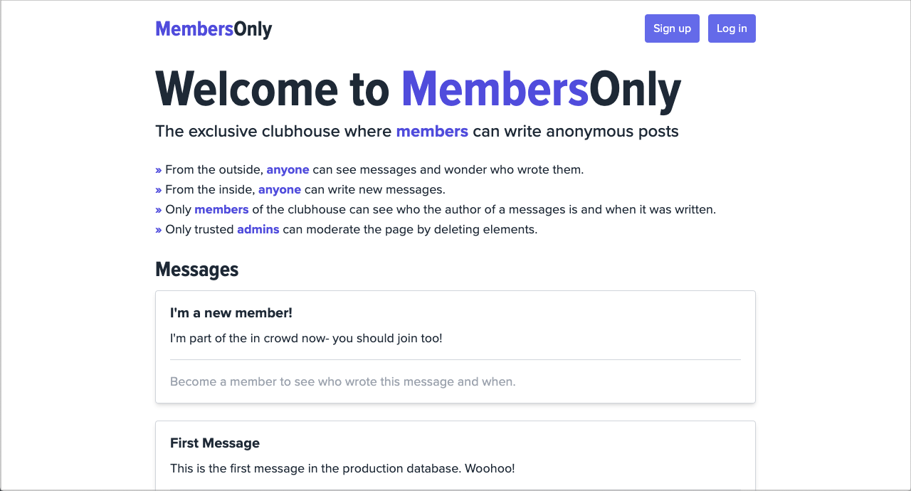
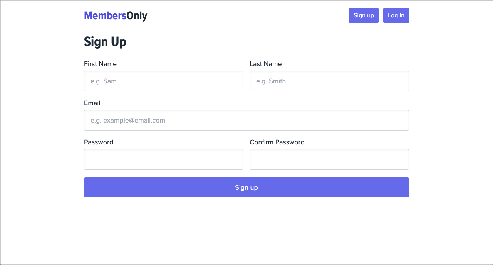

# Members Only

A secret messaging board that allows different levels of user interaction based on access.

**[Click here to view the live site](https://members-only-ma.fly.dev/)**

## How to Use

1. [Head to the live site](https://members-only-ma.fly.dev/) on any device (mobile, tablet or desktop – it doesn't matter)
1. Notice how you can view messages, but you can't see who wrote them or write your own. Let's fix that:
   - Click **Sign up** and create an account
   - Click **Log in** and enter in your login information
   - Click **New Message** and write your own message
1. You'll need to become a member to see who wrote messages and when.
   - Click **Become a Member**
   - Enter the secret passcode to become a member. The riddle provides a hint. (If you can't figure it out, you can see the answer at the bottom of this README.)
   - Congrats, now you're a member of the clubhouse! Go back to the homepage and see who wrote each message and when.
1. If you want to help moderate this site, you'll have to become an admin
   - Click **Become an Admin** (you have to be a member first in order to see this link)
   - Enter the top secret passcode to gain your admin privileges. There's no hint for this one. (The answer is at the bottom of this README – use it wisely; with great power comes great responsibility.)
   - Congrats, now you're an admin! Go back to the homepage and delete messages as you see fit.

## Project Objectives

This project was built in order to practice implementing the following skills:

- Implement user authentication using the [PassportJS](https://www.passportjs.org/) middleware in Node.js/Express
- Secure passwords (hashing and salting) with [bcrypt](https://www.npmjs.com/package/bcryptjs)
- Use a MongoDB database to store user, message, and session data
- Implement the [**Model-View-Controller (MVC)**](https://developer.mozilla.org/en-US/docs/Glossary/MVC) software design pattern
  - Build models to define what data structures my app should contain
  - Set up routes for requesting different information and templates (i.e. views) to render the data as HTML to be displayed in the browser
  - Build controllers for updating models and/or views in response to input from users of my app
- Build views and work with forms in Express using the EJS templating engine
- Add some client-side JavaScript to make my app more responsive and handle deletion confirmation
- Deploy my application to production

## Technologies Used

### Languages
- JavaScript
- CSS
- EJS – Embedded JavaScript templating engine

### Frameworks and Tools
- Node.js
- Express
- MongoDB, Mongoose
- Tailwind CSS
- Git (obviously)

### Libraries and Middleware
- [PassportJS](https://www.passportjs.org/) – authentication middleware for Express
- [bcryptjs](https://www.npmjs.com/package/bcryptjs) – for securing passwords by hashing and salting
- [connect-mongo](https://www.npmjs.com/package/connect-mongo) – MongoDB session store middleware for Express
- [express-async-handler](https://www.npmjs.com/package/express-async-handler) – asynchronous exception-handling middleware for Express
- [express-validator](https://www.npmjs.com/package/express-validator) – user input validation middleware for Express
- [Dotenv](https://www.npmjs.com/package/dotenv) – for keeping my database connection strings and API keys secret
- [He](https://www.npmjs.com/package/he) – for encoding and decoding HTML entities
- [helmet.js](https://helmetjs.github.io/) – Express middleware to protect from well-known web vulnerabilities
- [express-rate-limit](https://express-rate-limit.mintlify.app/quickstart/usage) – rate-limiting middleware for Express
- [date-fns](https://date-fns.org/) – date utility library

## Credits

- SVG icons from [Pictogrammers](https://pictogrammers.com/library/mdi/)

## Top-Secret Passcodes

- Become a member: `leaves`
- Become an admin: `theB00khouseBoys`
  - Use this wisely; with great power comes great responsibility
